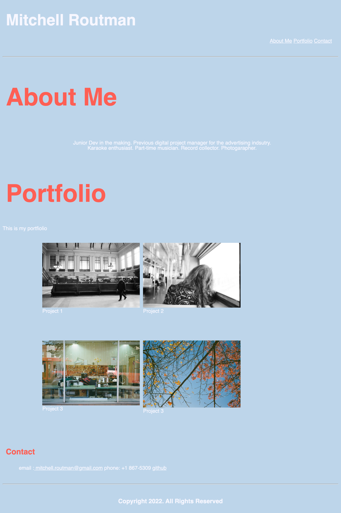

# MITCHELL ROUTMAN - PORTFOLIO

# DESCRIPTION
The goal of this project was to create an initial draft of a functional website using HTML and CSS to display and share projects. This resolves the issue that many new developers face - the inability to showcase work for future employment. 

`Previous Site
    

# TABLE OF CONTENTS
 - [Installation](#installation)
 - [Usage](#usage)
 - [Credits](#credits)
 - [License](#license)

# INSTALLATION
Clone the working files and open the index.html using your preferred browser. 

## USAGE
This site is to be used for personal development purposes only and shared with potential employers. The site should render as below

## CREDITS
CSS reset by Myerweb - [http://myerweb.com/eric/tools/css/reset/](http://meyerweb.com/eric/tools/css/reset/)

## LICENSE
Open source

---

